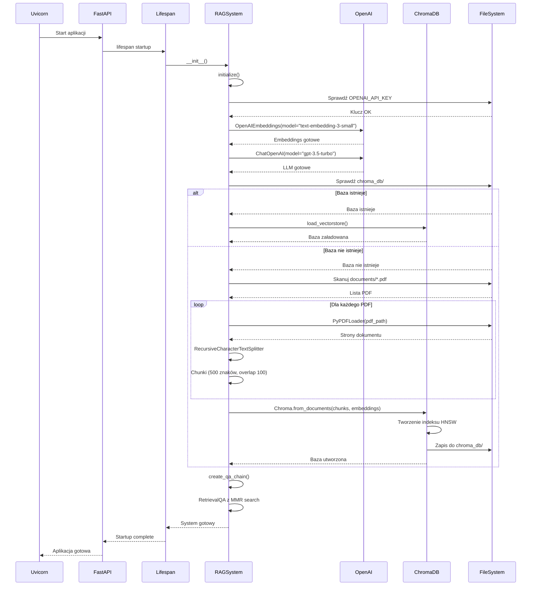
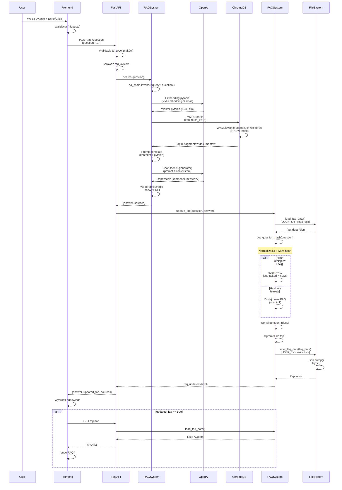
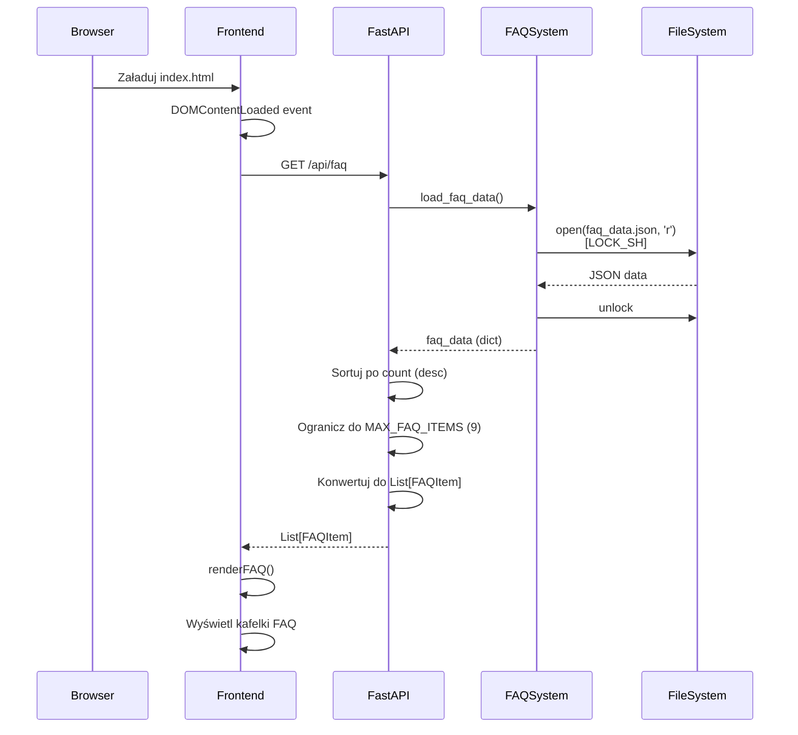
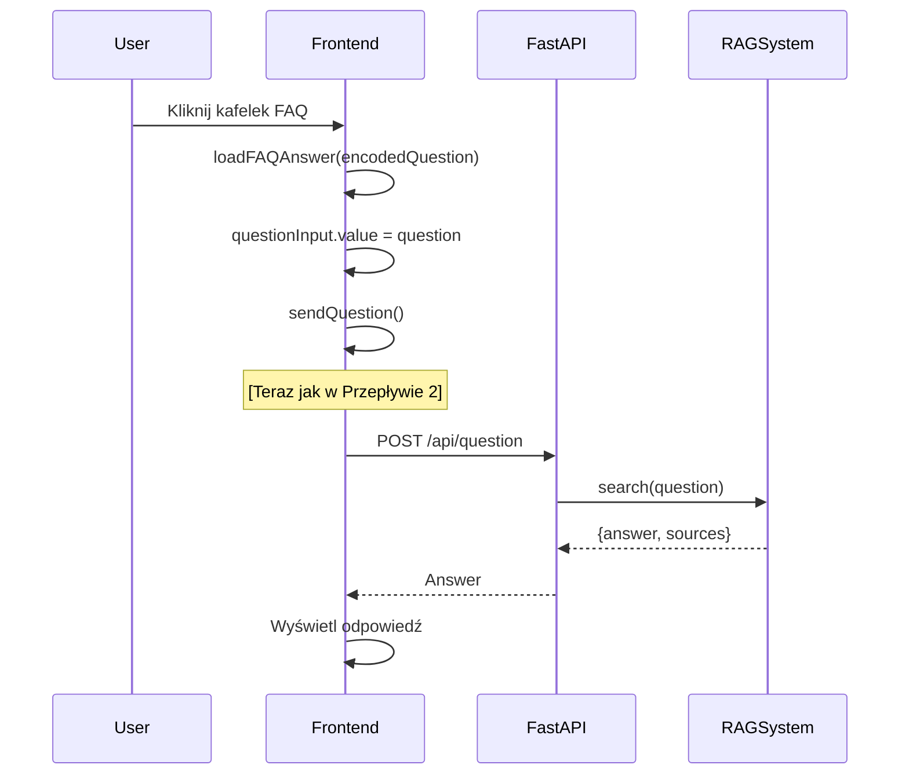
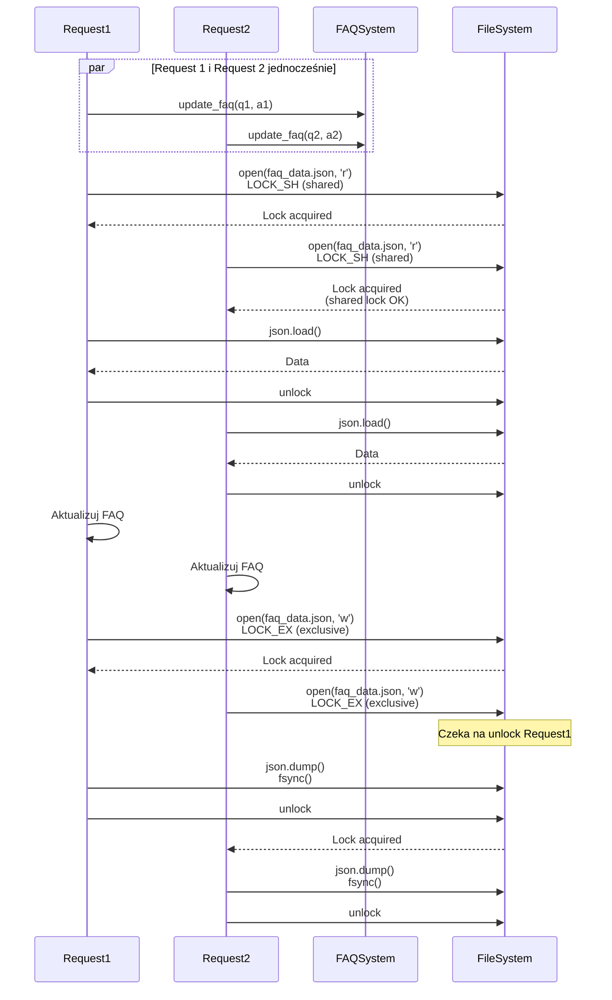
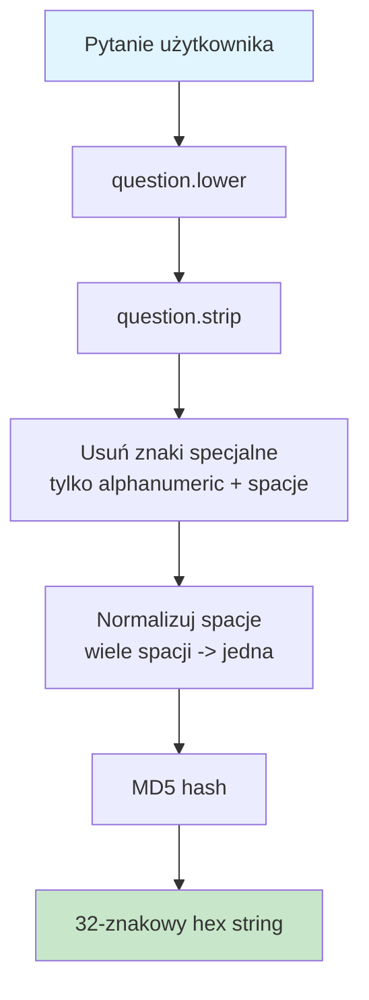
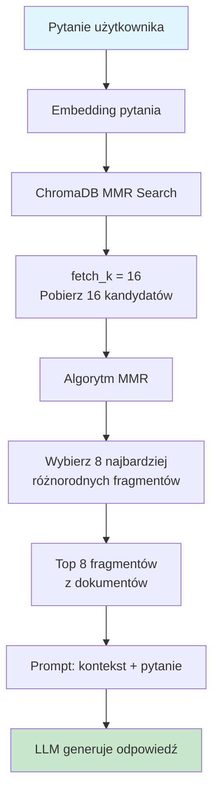
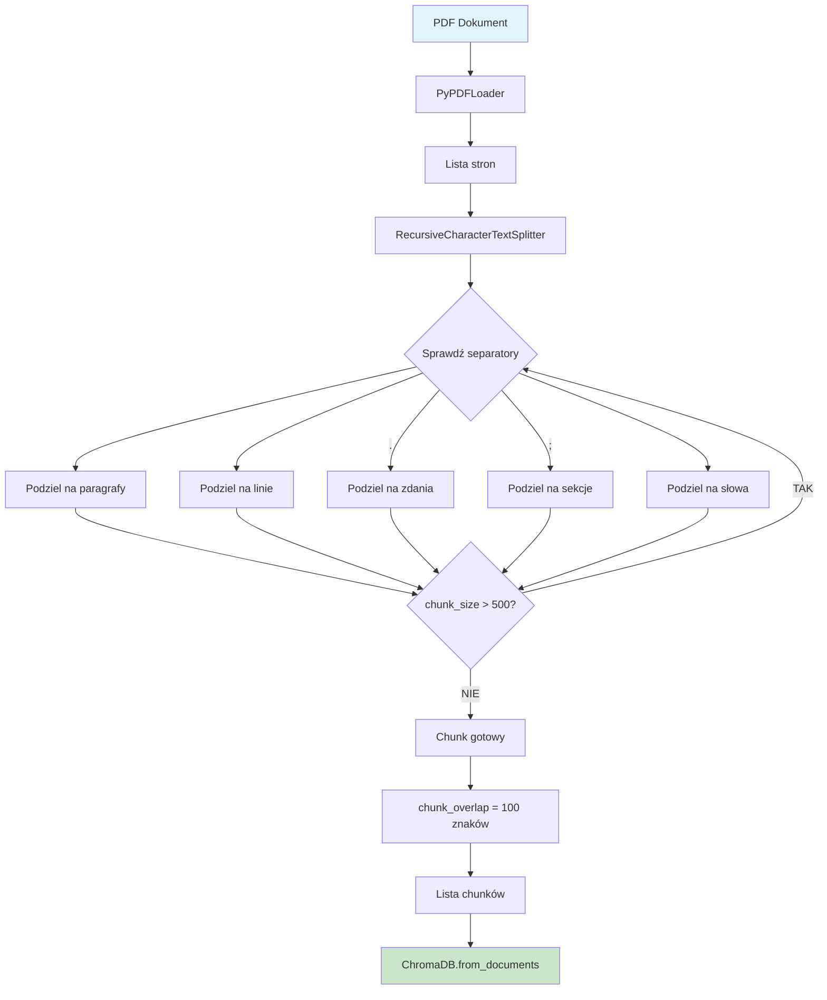
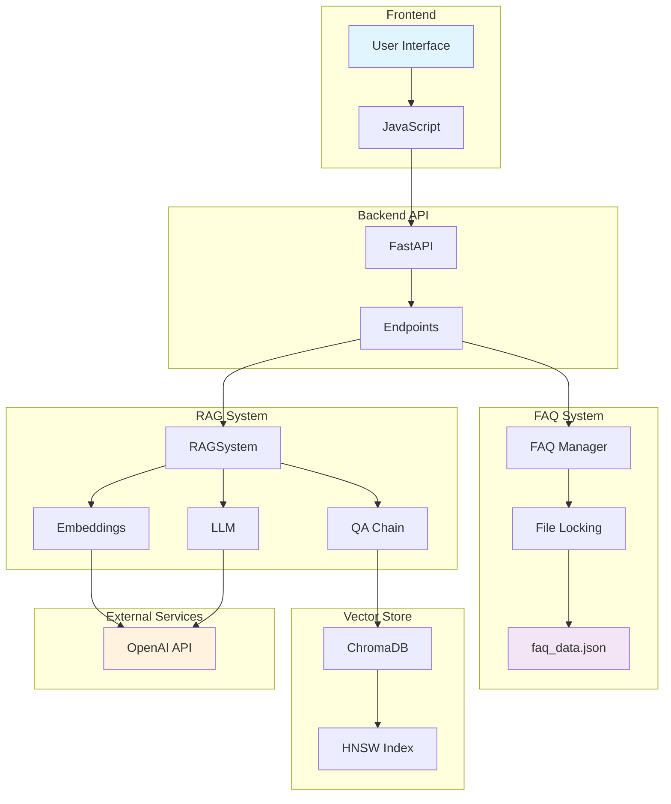
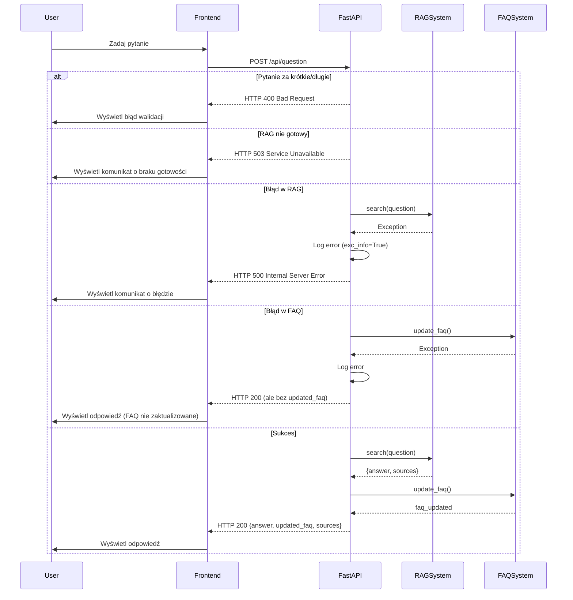

# Diagramy Przepływu Systemu hhg_baza_wiedzy - Mermaid

## 1. Inicjalizacja Systemu

## 2. Zadawanie Pytania (Główny Przepływ)

## 3. Ładowanie FAQ przy Starcie

## 4. Kliknięcie w Kafelek FAQ

## 5. File Locking - Race Condition Prevention

## 6. Hash'owanie Pytań

## 7. MMR Search (Maximum Marginal Relevance)

## 8. Chunking Dokumentów

## 9. Pełny Przepływ Systemu (High-Level)

## 10. Error Handling Flow

